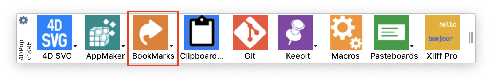
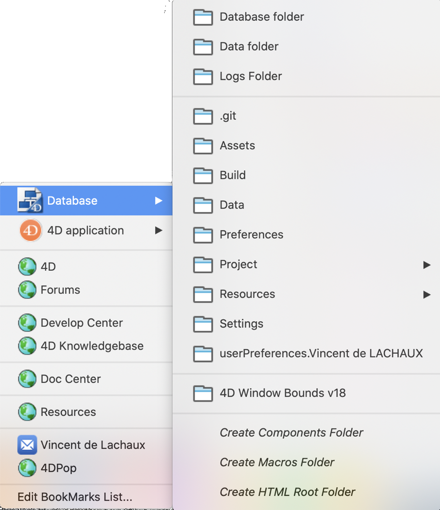
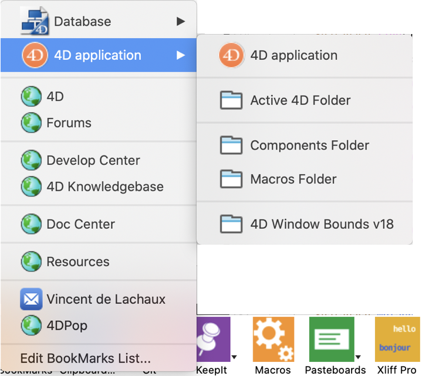
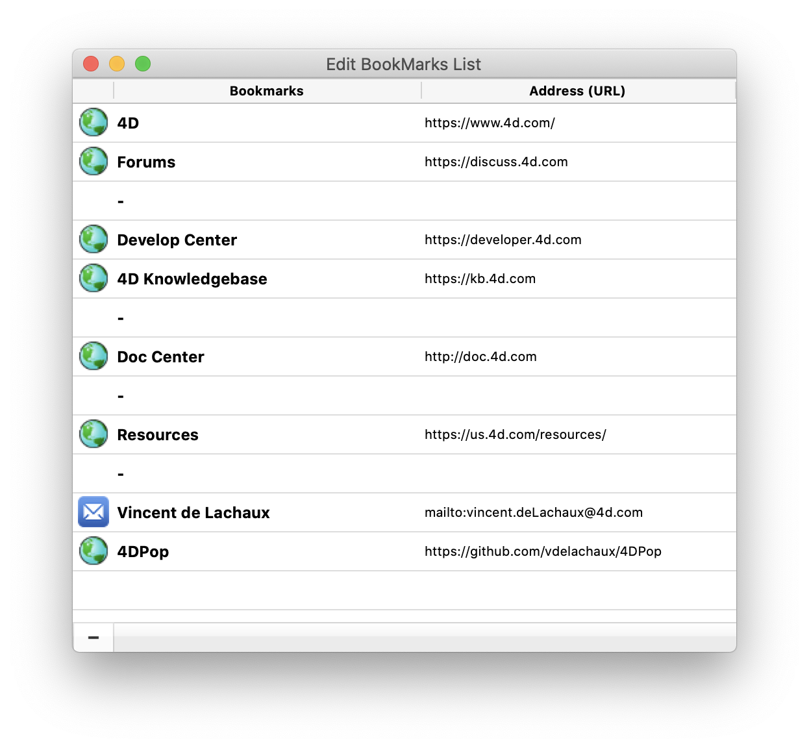

<!-- MARKDOWN LINKS & IMAGES -->
[code-shield]: https://img.shields.io/static/v1?label=language&message=4d&color=blue
[code-url]: https://developer.4d.com/
[license-url]: LICENSE
[notarized]: https://img.shields.io/badge/notarized-blue

[code-top]: https://img.shields.io/github/languages/top/vdelachaux/4DPop-Bookmarks.svg
[code-size]: https://img.shields.io/github/languages/code-size/vdelachaux/4DPop-Bookmarks.svg
[release-shield]: https://img.shields.io/github/v/release/vdelachaux/4DPop-Bookmarks?include_prereleases
[release-url]: https://github.com/vdelachaux/4DPop-Bookmarks/releases/latest
[license-shield]: https://img.shields.io/github/license/vdelachaux/4DPop-Bookmarks
[build-shield]: https://github.com/vdelachaux/4DPop-Bookmarks/actions/workflows/build.yml/badge.svg
[build-url]: https://github.com/vdelachaux/4DPop-Bookmarks/actions/workflows/build.yml

[![language][code-shield]][code-url]
[![language-top][code-top]][code-url]
![code-size][code-size]
[![license][license-shield]][license-url]
[![release][release-shield]][release-url]
[![build][build-shield]][license-url]
![notarized][notarized]

# 4DPop-Bookmarks

4DPop Bookmarks manages your bookmarks (and more) from your development environment.

## Installation

Place the `4DPop_Bookmarks.4dbase` folder or an alias to it:

* in the `Components` folder next to your database structure file if you want to use it only with this database.

* in the `Components` folder in 4D if you want to use it with all your databases.

If you use the `4DPop` component, the `Bookmark` tool will automatically appear in the tool palette; just click on it to display and use it.

## Use

`4DPop Bookmarks` displays a menu allowing direct access to folders related to the database or to the 4D environment. Then a list of user bookmarks (for example: a folder, a document, a web URL…). 

   

According to the bookmark type, selecting one of them loads the associated URL in the default browser, reveals the folder, opens the file or create a mail.

The last menu item, "Edit BookMarks List...", allow you to modify the list of bookmarks.
 

Adding bookmarks can be done by drag and drop from the desktop to the editor (file, folder or disk), from your browser (email address and URL) or from a text box. The dragged item is analyzed and the created menu item automatically indicates its type by associating a specific icon to it.

It is possible to delete an item by selecting it and clicking the "-" button (shortcut "delete").

You can change the bookmark name or URL by double-clicking on the part you want to edit. You can also rearrange the items by dragging and dropping, or sort them by column headers.

Note: A bookmark that begins with a dash ("-") will be displayed as a separator line in the menu.
